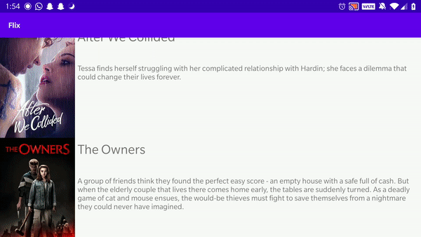

# Flix
Flxtr is an app that allows users to browse movies from the [The Movie Database API](http://docs.themoviedb.apiary.io/#).

## Flix Part 1

### User Stories
#### REQUIRED (10pts)
- [X] (10pts) User can view a list of movies (title, poster image, and overview) currently playing in theaters from the Movie Database API.

#### BONUS
- [ ] (2pts) Views should be responsive for both landscape/portrait mode.
   - [X] (1pt) In portrait mode, the poster image, title, and movie overview is shown.
   - [ ] (1pt) In landscape mode, the rotated alternate layout should use the backdrop image instead and show the title and movie overview to the right of it.
          - Doesn't change the image used

### App Walkthough GIF

Imgur link: https://imgur.com/a/5Vn2KlF 

### Notes
Didn't get the time this week to do as much as hoped, but should be more free from hereon out.

### Open-source libraries used

- [Android Async HTTP](https://github.com/codepath/CPAsyncHttpClient) - Simple asynchronous HTTP requests with JSON parsing
- [Glide](https://github.com/bumptech/glide) - Image loading and caching library for Androids
